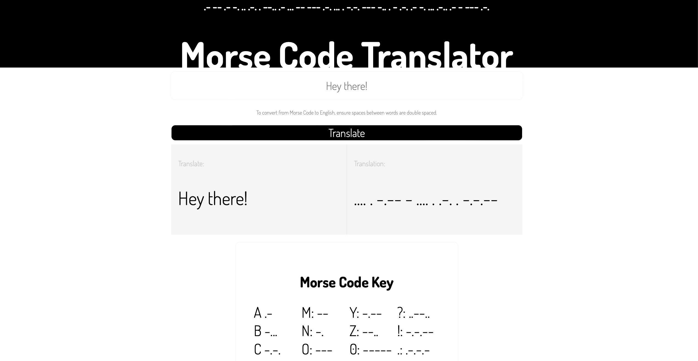

# Morse Code Translator

## Project Decription

The project converts the english language to morse code and visa versa. The project utilises a combination of HTML, CSS and JavaScript to detetect characters of the opposing language and translate them into a single string.

## Table of Contents:

-   dom.js
-   index.html
-   morseCodeKey.js
-   script.js
-   styles.css
-   utils.text.js
-   README.md

## Implementation

The logic behind this project was to retrieve a search term and convert it into an array, then individally assess each character against the object, morseCode. The object acts as the central conversion between English and Morse Code characters. The translator function returns the converted string in the opposite language.

Utilising an object will allow for easy addition to the library in the future of more abstract characters such as symbols and punctuation.

## How to use the Translator:

Type any text into the input box and click "Translate".

To convert from morse code to English, ensure any spaces between words are n

## MVP

Project: Morse Code TranslatorCreate a webpage that allows users to input english and get a more code output, and input morse code and get an english outputMVP:

-   Must support the alphabet, spaces, numbers
-   Must give user feedback when they input unsupported characters - errors
-   Must be able to translate both ways
-   Project must use javascript modules to seperate dom logic from vanilla js logic
-   Can use react, or vanilla js. - include bootstrap if using vanilla js. If choosing react, need to look into how to testing in react
-   Functions you write must be unit tested (you won't be able to write unit tests for function that interact with the dom)
-   Must look NICE, this will go on your portfolio

## Future Goals / Extending in Future

-   Allow for sentence case in the conversion;
-   Repair the conversion for spaces from morse code to english;
-   Implement a dark mode
